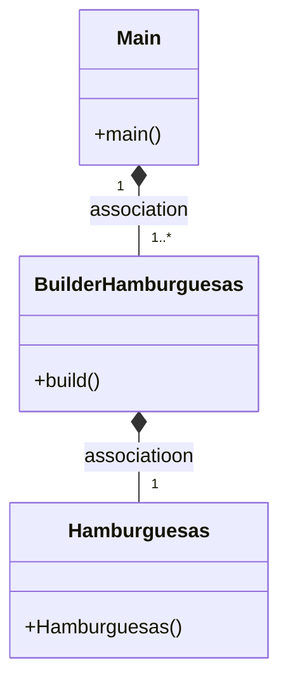

# 2 Ejercicio Examen
-El builder es un patrón de diseño que permite al 
constructor de una clase poder cambiar objetos complejos paso a paso por
ejemplo si tuviéramos una aplicación de una hamburguesería para hacer
dfierentes tipos de hamburguesas de forma eficaz podemos usar el builder así:

Una clase Hamburguesas con todos los parámetros, los constructores y los setters
y getters que no he puesto en el ejemplo.
```
public class Hamburguesas {
    private int size;
    private boolean pepinillo;
    private boolean cebolla;
    private boolean sinGluten;
    private int recojida;


    // tamaño de la hamburguesa
    public static final int SMALL = 0;
    public static final int MEDIUM = 2;
    public static final int BIG = 3;

    // recojida
    public static final int TIENDA = 0;
    public static final int PARALLEVAR = 1;

    public Hamburguesas(){
        this.cebolla = true;
        this.recojida = TIENDA;
        this.pepinillo = true;
        this.sinGluten = false;
        this.size = MEDIUM;
    }

    public Pizzas(int size,boolean pepinillo,boolean cebolla, boolean sinGluten, int recojida) {
        this.size = size;
       this.pepinillo=pepinillo;
        this.cebolla = cebolla;
        this.sinGluten = sinGluten;
        this.recojida = recojida;
    }
```
Luego una clase BuilderHamburguesas que contruya nuestra hamburguesa deseada
con el constructor, el método build y los setter que no he puesto de todos 
los parámetros:
```
public class BuilderHamburguesas {

    private Hamburguesas _hamburguesas;

    public BuilderHamburguesas(){
        _hamburguesas = new Hamburguesas();
    }
    }
```
Por último en la main crearíamos la hamburguesa que más nos guste, por ejemplo una sin
pepinillos:
```
public class Main {

    public static void main(String[] args) {
Hamburguesas hamburguesaSinPepinillos=new BuilderHamburguesas()
                  .setPepinillo(false)
                  .build();
        System.out.println(hamburguesaSinPepinillos.toString());
```
Y este sería el diagrama del builder de hamburguesas:


-Sí ,podríamos fusionar el builder con el patrón factory, de tal forma que 
podríamos hacer una factory de pizzas en la cúal en las clases que nos convengan 
de la factoría por ejemplo barco bicileta y camión las podriamos usar
para transportar el pedido de tal forma que la Pizza tenga un parámetro que sea tipo
de envío del cúal dependa el Factory quedaría así reflejada en la main:
```
Pizzas pizzaPorBarco = new BuilderPizzas()
.setTipoEnvío("barco")
.build();
System.out.println(pizza3.toString() +"\n")
 // CAMIÓN
             if(BuilderPizzas.getTipoEnvío="camión"){
                transporte = FactoriaDeTransportes.getProducto(FactoriaDeTransportes.CAMION);
        System.out.println("Camion:"+"El coste del envio es de: "+transporte.costeTotal(54000));
                int tipoC= transporte.tipoEmbalaje(120f,120f,120f,120f);
                if(tipoC == 0)
                    System.out.println(tipoC+"-->"+ITransporte.Pale);
                else if(tipoC == 1)
                    System.out.println(tipoC+"-->"+ITransporte.CajaCarton);
                else
                    System.out.println(tipoC+"-->"+ITransporte.CajaMadera);
                    }
                    else if(BuilderPizzas.getTipoEnvío="bicicleta"){
                //BICICLETA
                transporte = FactoriaDeTransportes.getProducto(FactoriaDeTransportes.BICICLETA);
        System.out.println("Bicileta:"+"El coste del envio es de: "+transporte.costeTotal(20000));
               int tipoB =transporte.tipoEmbalaje(24f,24f,24f,24f);
               if(tipoB == 0)
                   System.out.println(tipoB+"-->"+ITransporte.Pale);
               else if(tipoB == 1)
                   System.out.println(tipoB+"-->"+ITransporte.CajaCarton);
               else
                   System.out.println(tipoB+"-->"+ITransporte.CajaMadera);
                   }
                   else{
        //Barco
        transporte = FactoriaDeTransportes.getProducto(FactoriaDeTransportes.BARCO);
        System.out.println("Barco:"+"El coste del envio es de: "+transporte.costeTotal(18000));
        int tipoBar= transporte.tipoEmbalaje(220f,220f,220f,220f);
        if(tipoBar == 0)
            System.out.println(tipoBar+"-->"+ITransporte.Pale);
        else if(tipoBar == 1)
            System.out.println(tipoBar+"-->"+ITransporte.CajaCarton);
        else
            System.out.println(tipoBar+"-->"+ITransporte.CajaMadera);
            }
            }
        }
        
 ```

